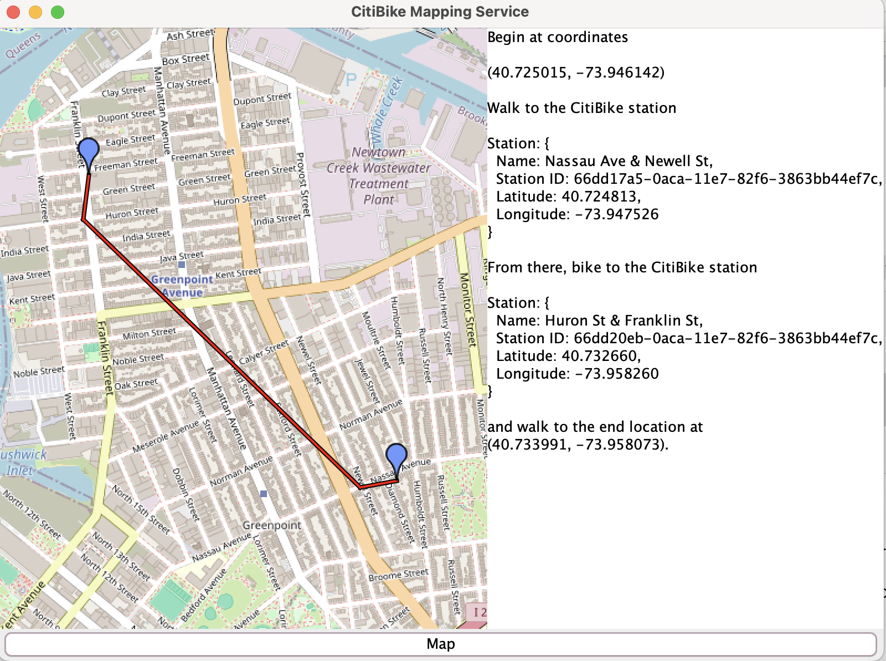

# CitiBike Mapping Application

Given two points, map the closest CitiBike stations to each and draw the mapped route.

### Resources:
- [CitiBike API](https://gbfs.citibikenyc.com/gbfs/2.3/gbfs.json)
- [JXMapViewer](https://github.com/msteiger/jxmapviewer2)
- [AWS Lambda](https://aws.amazon.com/lambda/)
